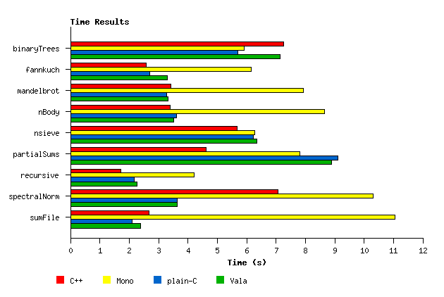
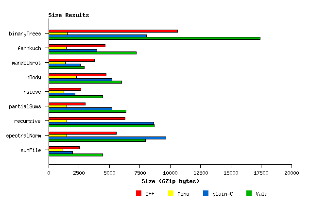

# Vala Benchmarks

This repository contains an updated version of the Vala Benchmarks hosted on [Google Code Archive][vala-benchmarks], whose main purpose was to include [Vala][vala] to [The Computer Language Benchmarks Game][clbg].

I just took that repository and made it work on my machine.

## Results

[vala]:https://wiki.gnome.org/Projects/Vala
[vala-benchmarks]:https://code.google.com/archive/p/vala-benchmarks/
[clbg]:http://benchmarksgame.alioth.debian.org/

